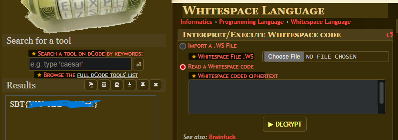

# D-crypt
**#ShellCommand** **#Cryptogrphy** 
[My achievement](https://blueteamlabs.online/achievement/share/challenge/68894/20)

---

## 1. Scenario
An intelligence agency gave us a zipped file to analyze. They say they obtained it from a suspected terrorist trying to send it to one of its allies. We trust you to uncover the hidden message but do not tell anyone about it. Sshhh ...

## 2. Challenge
### Question: What is the hidden message?
The challenge presented a simple picture without any additional information and prompted me to search for a hidden flag within it.


First, i used `exiftool` command to collect all metadata of that picture.

But I could not find any useful information. Therefore, I decided to use `steghide`  (a tool capable of hiding data within a variety of image and audio files). In this challenge, I used one of its functions in the hopes of extracting the hidden data.


As you can see, there was no hidden data. I spent several minutes trying to find possible hints until I came across the `strings` command, which allowed me to extract all the readable text from file. Through this, I got a lucky hint.


In the final line of the result, the text `message.png` appeared. This made me think that the picture might contain another picture within it, similar to a zip file. I then attempted to extract the picture within by using the `unzip` command.


Yes, it worked. I was able to extract the image within, but I got an error when trying to open this image using the display app. 


So I used the `file` command to check the file type, and I found that it was a text file, not an image file. This was why I encountered errors when trying to open it using the display app.


This is a content of file:

<details>
<summary>Content in file</summary>

```
h5BA68F35I_%3E%3B%3BG3gdc%3E%3EFF9g5deA82hhh%3F%3Ea%3B22gdh%3Ee%3B%3B%6025%60A682bhddeA82h4IBA68F2gd%60%3E%3B%3B%3B%60g5c%3E%3EFF%60hd%3C%3Ea%3EFbhh_%3Fe8F255g%3EeEG32d%60%3EA83hg5%3C%3EaF2bhhB%3Fa8Gf55g%3Ee%3B%3C32d%60A6FF9g5%3CAA82hhh%3F%3Ea%3B22gd%60%3E%3BEG32d%60A6FGfg5%3CAJ82hh5%3F%3Ea%3B3f55_%3E%3BEG32d%60A682bhddeA82hhh%3F%3Fa8F2gdh%3Ee%3B%3B%60g5c%3EAGF9g5dca8Fhhh_%3Fe8Gfgd%60%3E%3B%3BF%6025%60A682bhd%3CAA82h4I_A%3B8Gfgdh%3EeEG3gdc%3E%3E82bhd%3CAJ%3E2bhh_%3Fe8F255g%3EeEF%60g5c%3EAFF%60hd%3CAA%3E2b4I%3F%3Ea%3B3fgd%3E%3EeEF%60g5cA6FF9g5%3C%3Ea8Fhh5%3F%3Ea%3B22gdh%3EeEG3gdcA683hg5deA%3E2bhh%3F%3Ea%3B22gd%60%3E%3BEG72d%60A682bhd%3C%3Ea%3EFb4I_%3Ee%3B23gdh%3EeEF%6025%60A6FF%60hd%3C%3EaF2bhh%3F%3Ea%3B3f55g%3EeEF%60g5c%3EAFF9g5deA%3E2b4I%3F%3Ea%3B3fgd%3E%3EeEF%6025%60A6FF9g5%3C%3Ea8Fhh5%3F%3Fa8F255g%3EeEG3gdcA683hg5%3CAA%3E2bhh_%3Ee%3B22gd%60%3E%3BEG72d%60%3E%3E82bhddeA82h4I_A%3B8Gf55_%3E%3BEG32d%60%3E%3E82bhd%3CAJ82h4I%3F%3Ea%3B3f55g%3EeEF%60g5c%3EAFF%60hd%3C%3Ea8Fhhh_%3Ee%3B3f5Ig%3EeEG32d%60%3E%3EFF9g5%3C%3Ea8Fhh5_%3Fe8Gf55_%3E%3BEF%605d%60A682bhc 
```
</details>

This text look like be encoded by `URL encode`, so i decoded it.
<details>
<summary>Decoded text</summary>

```
h5BA68F35I_>;;G3gdc>>FF9g5deA82hhh?>a;22gdh>e;;`25`A682bhddeA82h4IBA68F2gd`>;;;`g5c>>FF`hd<>a>Fbhh_?e8F255g>eEG32d`>A83hg5<>aF2bhhB?a8Gf55g>e;<32d`A6FF9g5<AA82hhh?>a;22gd`>;EG32d`A6FGfg5<AJ82hh5?>a;3f55_>;EG32d`A682bhddeA82hhh??a8F2gdh>e;;`g5c>AGF9g5dca8Fhhh_?e8Gfgd`>;;F`25`A682bhd<AA82h4I_A;8Gfgdh>eEG3gdc>>82bhd<AJ>2bhh_?e8F255g>eEF`g5c>AFF`hd<AA>2b4I?>a;3fgd>>eEF`g5cA6FF9g5<>a8Fhh5?>a;22gdh>eEG3gdcA683hg5deA>2bhh?>a;22gd`>;EG72d`A682bhd<>a>Fb4I_>e;23gdh>eEF`25`A6FF`hd<>aF2bhh?>a;3f55g>eEF`g5c>AFF9g5deA>2b4I?>a;3fgd>>eEF`25`A6FF9g5<>a8Fhh5??a8F255g>eEG3gdcA683hg5<AA>2bhh_>e;22gd`>;EG72d`>>82bhddeA82h4I_A;8Gf55_>;EG32d`>>82bhd<AJ82h4I?>a;3f55g>eEF`g5c>AFF`hd<>a8Fhhh_>e;3f5Ig>eEG32d`>>FF9g5<>a8Fhh5_?e8Gf55_>;EF`5d`A682bhc 
```
</details>

Then i used [dcode.fr](https://www.dcode.fr/cipher-identifier) to hope to identify what algorithm used for that text. From [dcode.fr](https://www.dcode.fr/cipher-identifier), ant its result is:


The tool suggested `the ROT-47 Cipher` as the most likely result, so I used this algorithm to decrypt the text.
 

<details>
<summary>Result of ROT-47 Cipher</summary>

```
9dqpegubdx0mjjvb854mmuuh8d56pga999nm2jaa859m6jj1ad1pega39556pga9cxqpegua851mjjj18d4mmuu195km2mu3990n6guadd8m6tvba51mpgb98dkm2ua399qn2gv7dd8m6jkba51peuuh8dkppga999nm2jaa851mjtvba51peuv78dkpyga99dnm2jb7dd0mjtvba51pega39556pga999nn2gua859m6jj18d4mpvuh8d542gu9990n6gv7851mjju1ad1pega395kppga9cx0pjgv7859m6tvb854mmga395kpyma3990n6guadd8m6tu18d4mpuu195kppma3cxnm2jb785mm6tu18d4peuuh8dkm2gu99dnm2jaa859m6tvb854pegb98d56pma399nm2jaa851mjtvfa51pega395km2mu3cx0m6jab859m6tu1ad1peuu195km2ua399nm2jb7dd8m6tu18d4mpuuh8d56pma3cxnm2jb785mm6tu1ad1peuuh8dkm2gu99dnn2guadd8m6tvb854pegb98dkppma3990m6jaa851mjtvfa51mmga39556pga9cx0pjgv7dd0mjtvba51mmga395kpyga9cxnm2jb7dd8m6tu18d4mpuu195km2gu9990m6jb7dx8m6tvba51mmuuh8dkm2gu99d0n6gv7dd0mjtu1d51pega394
```
</details>

The text did not contain any meaningful information, so I continued to use the tool to identify other possible algorithms. It suggested that the `Base-32 Crockford` algorithm may have been used. 


I attempted to decrypt the text once more using the suggested algorithm. However, [dcode.fr](https://www.dcode.fr/cipher-identifier) could not decode it for some reasons. I then tried to use the tool recommended by the author of the challenge ([tool](https://www.browserling.com/tools/base32-decode)), and it worked.

<details>
<summary>Result of Base32 Decode</summary>

```
KogCKoAIKkAIJkQCJkAIJkAIJASCJASCgACIJkAIgogCJACIJACIJkAIgASCJASCJkQCgkQCKAiCgAiCJoQCgkQCJkQCgkQCgkAIJkAIJACIgkQCgkgCgoAIKkAIgkAIgkQCgACIJkAIJkQCJASCJACIKoQCJACIJASCgACIKASCgACIgkAIgAiCgASCgkAIJACIgoQCJASCJkQCgACIKkAIgkQCgkAIgAiCgACIgkQCgACIKkAIJASCgkAIgAiCJkQCJkAIJACIgoQCgACIgASCgACIKASCgASCgkAIgAiCJkAIgkQCgACIKkQCJkQCgkAIgAiCgASCgkQCgACIKkQCJkQCgkAIgAiCgkQCJACIJACIgoQCJACIJkAIgAiCgkAIgkQCJACIgoAIgkAIgkQCgACIKkAIgACIJACIgoQCgkQCJkQCgACIKASCgkAIgAiCgACI
```
</details>

I was beginning to get stuck here. I spent many hours on this, because [dcode.fr](https://www.dcode.fr/cipher-identifier) could not suggest a correct algorithm for this text, all algorithms led me to a dead end. So i tried various methods to gather more hints, but to no avail. Finally, I found a tip on Reddit suggesting that I reverse the text to find potential clues. 

<details>
<summary>Reversed text of Base32 Decode</summary>

```
ICAgCiAgIAkgCSAKICAgCQkJCQkgCQogICAJICAgIAkKICAgCQkgIAkgIAogICAJCQkgIAkgCiAgIAkJICAJCQogICAJICAJCQkgCiAgIAkgCQkJCQkKICAgCQkgCSAgCiAgIAkgCQkJCQkKICAgCQkgIAkJCiAgIAkgCSAgCSAKICAgCSAgICAgCQogICAJIAkJCQkJCiAgIAkgCSAJIAkKICAgCQkgICAgCiAgIAkgCQkgIAkKICAgCQkJCSAJCQogICAJIAkgCSAgCiAgIAkgICAgCSAKICAgCSAJICAJCQoKICAJCSAJCQkJIAkJICAgCQkgIAkgIAkKIAogCgkgCQkgICAJIAkJIAkgCQkgCQkJCQkgCQoJCiAgCiAKCQkgCQkJCSAJCSAgIAkJICAJICAJCgogIAkJICAgCSAJCSAJIAkJIAkJCQkJIAkKIAoKCgoK
```
</details>

Then i tried it with Base64 Encode to get infomation.


<details>
<summary>Result of Base64 Decode</summary>

```
   
   	 	 
   					 	
   	    	
   		  	  
   			  	 
   		  		
   	  			 
   	 					
   		 	  
   	 					
   		  		
   	 	  	 
   	     	
   	 					
   	 	 	 	
   		    
   	 		  	
   				 		
   	 	 	  
   	    	 
   	 	  		

  		 				 		   		  	  	
 
 
	 		   	 		 	 		 					 	
	
  
 
		 				 		   		  	  	

  		   	 		 	 		 					 	
 


```
</details>

It was a blank text, but I recognized it from a previous CTF challenge that I have played. In that challenge, the clear text had been transformed into whitespace and tab characters, which was intended to confuse the player. If you use IDE like VSCode, you will see these characters more clearly.


So i just decode that blank text to get hidden text behind it.



Yeah, i finally got the flag.

<details>
<summary>The flag</summary>

```
Try it yourself
```
</details>