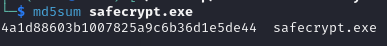

# Network Analysis - Ransomware
**#Analyze** **#WireShark** **#Malware**

[My achievement](https://blueteamlabs.online/achievement/share/challenge/68894/3)

---

## 1. Scenario
ABC Industries worked day and night for a month to prepare a tender document for a prestigious project that would secure the company’s financial future. The company was hit by ransomware, believed to be conducted by a competitor, and the final version of the tender document was encrypted. Right now they are in need of an expert who can decrypt this critical document. All we have is the network traffic, the ransom note, and the encrypted ender document. Do your thing Defender!​

## 2. Challenge
This is a letter that the attacker sent to their victim as part of a ransom scheme.


### Q1. What is the operating system of the host from which the network traffic was captured? (Look at Capture File Properties, copy the details exactly)
The answer can be found by following the guidelines provided in the question.


<details>
<summary>Answer</summary>

```
32-bit Windows 7 Service Pack 1, build 7601
```
</details>

### Q2. What is the full URL from which the ransomware executable was downloaded?
It may be related to the HTTP protocol because of the keywords `URL` and `download`. Therefore, I used **Wireshark** to filter all packets that used the HTTP protocol.


As you can see, there are 2 HTTP packets, one of them connected to URI `GET /safecrypt.exe` from host `10.0.2.15:8000`

<details>
<summary>Answer</summary>

```
http://10.0.2.15:8000/safecrypt.exe
```
</details>

### Q4. What is the MD5 hash of the ransomware?
Retrieve this ransomware by using `Export Object` funcion of WireShark


Then I used `md5sum` command to get MD5 hash of the ransomware



<details>
<summary>Answer</summary>

```
4a1d88603b1007825a9c6b36d1e5de44
```
</details>

### Q3. Name the ransomware executable file? 
I used [VirusTotal](https://www.virustotal.com/) with that MD5 Hash to get more information about this ransomware


<details>
<summary>Answer</summary>
A lot of vendors say that is 

```
Teslacrypt
```
</details>


### Q5. What is the encryption algorithm used by the ransomware, according to the ransom note?

<details>
<summary>Answer</summary>
From the above letter that attaker sent to his victim, the encryption algorithm is 

```
RSA-4096
```
</details>

### Q6. What is the domain beginning with ‘d’ that is related to ransomware traffic?
As you can see the picture from **Q2**, there is no domain beginning with ‘d’. So i tried to other protocols to find this domain. 

<details>
<summary>Answer</summary>
When I filtered **DNS protocol**, i finally found domain had that characteristic.


IP `10.0.2.4` was trying to request to DNS server `192.168.55.1` to resolve the domain to git its IP.

```
dunyamuzelerimuzesi.com
```
</details>

### Q7. Decrypt the Tender document and submit the flag
The file was encrypted using RSA-4096, a very strong encryption algorithm. Since it was impossible for me to crack the decryption key, so I searched for any solutions on the internet. Eventually, I came across an [article](https://www.bleepingcomputer.com/news/security/teslacrypt-shuts-down-and-releases-master-decryption-key/) that provided a decryption key and a tool to do that. Following the guidelines outlined in the article, I was finally able to decrypt the file and retrieve the flag

<details>
<summary>Answer</summary>

```
BTLO-T3nd3r-Fl@g
```
</details>