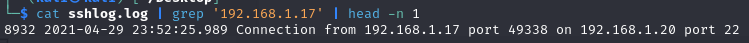

# Secure Shell
__**#DigitalForensics**__ __**#ShellCommand**__ 
[My achievement](https://blueteamlabs.online/achievement/share/challenge/68894/17)

---

## 1. Scenario
Hey! We had a SSH service on a system and noticed unusual change in size of the log file. Don’t panic, it was the new IT guys’ daughter who said she was able to break into the system. I had given her permission to test some of these services. I am giving you the log file, can you solve the following queries?

## 2. Challenge
The common attack on the SSH service is brute force, and there were a ton of log lines (`324,346 lines`) with timestamps from `2021-04-29 23:31:54.823` to `2021-04-30 01:17:16.071` (about 45 minutes). So i am sure that an attack occurred in this scenario.

### Q1. Is it an internal or external attack, what is the attacker IP?

The characteristic of a brute-force attack is that it involves numerous failed login attempts as attackers attempt to guess the correct password for a user. Therefore, I extract the IP addresses from the log entries that indicate a failed login and count the frequency of these IPs to identify the attacker's IP address. After searching how failed log look like on google, i found [this acticle](https://www.tecmint.com/find-failed-ssh-login-attempts-in-linux/) can help that. The characteristic is "**Failed password**" text be in log.

<details>
<summary>Solution</summary>

I will collect all log entries containing the text "**Failed password**", extract the IP addresses from them, and count the frequency of occurrence to determine the attacker's IP address.

The `grep` command will get log entries containing the text. The `awk` command will extract IP from result of `grep`. The `sort` and `uniq` command will count the frequency of IPs.

```shell
cat sshlog.log | grep 'Failed password' | awk '{ print $11 }' | sort | uniq -c | sort -n 
```
</details>

<details>
<summary>Answer</summary>

I found **5019** failure entries of `192.168.1.17`, which is local address. Therefore, it would be an internal attack.

```shell
internal:192.168.1.17
```
</details>

### Q2. How many valid accounts did the attacker find, and what are the usernames?

From [this acticle](https://serverfault.com/questions/1047754/where-can-i-view-successful-logon-attempts-for-sshd), the characteristic is "**Accepted password**" text be in log when someone login successfully.

<details>
<summary>Solution</summary>

When I used this command below to collect logs, **only one account** could be logged successfully with 2 log lines.


```shell
cat sshlog.log | grep 'Accepted password'
```
</details>

<details>
<summary>Answer</summary>

```shell
1:sophia
```
</details>


### Q3. How many times did the attacker login to these accounts?

<details>
<summary>Answer</summary>
From the results shown in the image from the previous question, there was only twice.

```shell
2
```
</details>


### Q4. When was the first request from the attacker recorded? 

We known the attack's IP address,  so we can identify the first log entry that contains it.

<details>
<summary>Solution</summary>


```shell
cat sshlog.log | grep '192.168.1.17' | head -n 1
```
</details>

<details>
<summary>Answer</summary>

```shell
2021-04-29 23:52:25.989
```
</details>

### Q5. What is the log level for the log file?

<details>
<summary>Answer</summary>

I noticed that the keyword **debug** appeared in a lot of log entries. Therefore, It must be current logging level.


```shell
DEBUG
```
</details>


### Q6. Where is the log file located in Windows?

<details>
<summary>Answer</summary>


```shell
C:\ProgramData\ssh\logs\ssh.log
```
</details>
