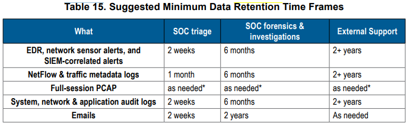

# The Report II
**#Analyze**

[My achievement](https://blueteamlabs.online/achievement/share/challenge/68894/44)

---

## 1. Scenario
This challenge is an extension for an existing 'The Report' challenge where you are working in a newly established SOC where there is still a lot of work to do to make it a fully functional one. As part of the SOC improvement process, you were assigned a task to study a report released by MITRE and suggest some useful outcomes for your SOC. Note: Answer the questions with the answers as the way you see in the document to avoid formatting issues. Report Link: https://www.mitre.org/sites/default/files/publications/11-strategies-of-a-world-class-cybersecurity-operations-center.pdf

## 2. Challenge
You need to read the book `11 Strategies Of A World Class Cybersecurity Operations Center`, search keyworks to find answers.

### Q1. Submit the name of the units/teams (in short form) that are responsible for maintaining network and other IT equipment, incident detection and response, and security compliance and risk measurement (Format: Team1, Team2, Team3)
From the page 11. you will know the team is responsible for maintaining network and other IT equipment:
> A NOC or IT operations center because a SOC is primarily looking for cyber attacks, whereas a NOC (and typically other IT operations staff) is concerned with operating and maintaining network and other IT equipment.

Also from page 11, team which is responsible for incident detection and response, is defined:
> Once again borrowing from the historical definition of “CSIRT,” RFC4949, Internet Security Glossary, Version 2 articulates three criteria that an organization must meet to be considered a CSIRT, which is also relevant to a SOC. For an organization to be considered an SOC, it must:
• Provide a means for constituents to report suspected cybersecurity incidents.
• Provide incident handling assistance to constituents.
• Disseminate incident-related information to constituents and external parties

From page 12, team is responsible for security compliance and risk measurement:
> An Information Security Continuous Monitoring (ISCM) program because the SOC is responsible for incident detection and response, whereas ISCM is generally focused on security compliance and risk measurement.

<details>
<summary>Answer</summary>

```
NOC, SOC, ISCM
```
</details>

### Q2. After investigation, what are the 4 suggested 'Response Options' mentioned in Basic SOC Workflow? (Format: Option1, Option2, Option3, Option4)

The answer is located in figure 3 on page 25.

<details>
<summary>Answer</summary>

```
Block Activity, Deactivate Account, Continue Watching, Refer to Outside Party
```
</details>

### Q3. What is the name of a military strategy used in SOCs to achieve a high level of situational awareness? (Format: Strategy Name)
The detail is defined in page 28, the mentioned is said:
>  The OODA Loop is a self-reinforcing situational awareness  decision cycle.

<details>
<summary>Answer</summary>

```
OODA Loop
```
</details>

### Q4. What is the name of the suggested organisational model if the constituency size is between 1000 to 10,000 employees (Format: Organisational Model Name)
From figure 6 on page 55, it describe the constituency size of each SOC Model:


<details>
<summary>Answer</summary>

```
Distributed SOC
```
</details>

### Q5. In a Large Centralised SOC, who is responsible for generating SOC metrics, maintaining situational awareness, and conducting internal/external trainings? (Format: Role Name)
Page 63 describes the responsibilities of a Large Centralised SOC. On of responsibility is:
> Situational Awareness, Communications, and Training:
    • These services may have their own dedicated section rather than being an additional duty of the SOC Lead.
    • There will be additional emphasis on coordination among the SOC elements as well as with external stakeholders and partners.
...................

<details>
<summary>Answer</summary>

```
SOC lead
```
</details>

### Q6. In Coordinating & National SOCs model what are the 2 functions mentioned as Optional Capability under Expanded SOC Operations Category? (Format: Function1, Function2)
Table 4 on page 74, it describes capability template:


<details>
<summary>Answer</summary>

```
Deception, Insider Threat
```
</details>

### Q7. What are the two virtual console technologies (in short form) mentioned to support Virtual SOC/ Remote Work scenarios during pandemics? (Format: Technology1, Technology2)
From page 91:
> The global phenomenon of COVID19 response forced virtually all SOCs to shift to a partial or total work from home conditions. Regardless of the reasons, the SOC should observe the following tips and tools for making virtual and work from home cultures successful:
• Leverage remote access virtual private network (VPN), virtual console like Integrated Lights-Out (iLO)/Integrated Dell Remote Access Controller (iDRAC), and cloud-based technologies
• Workstations and access that support remote work, such as virtual thin clients and low-trust/zero-trust architectures
...................


<details>
<summary>Answer</summary>

```
iL0, iDRAC
```
</details>

### Q8. What is the name of the model used to distribute work load of SOC 24/7 across different timezones to eliminate working at night hours? (Format: Model Name)
From page 97:
> In the “follow the sun” model, the SOC has two or three ops teams, each separated by many time zones. Each ops floor is on the watch during local business hours (e.g., 9 a.m. to 5 p.m.). In a three ops floor arrangement, at roughly 5 p.m. local time, one ops floor roll to the next ops floor, where it is 9 a.m. This pattern continues every eight hours, giving 24x7 coverage but without making people come to work in the middle of the night. A similar pattern ensures for two ops floors working 12 hours each.

<details>
<summary>Answer</summary>

```
Follow the Sun
```
</details>

### Q9. Submit the priorities(Low, Medium, High) assigned to Phishing, Insider Threat and Pre-incident Port Scanning activities respectively as per the Incident Prioritization mentioned in the document (Format: Priority1, Priority2, Priority3)
From page 129:


<details>
<summary>Answer</summary>

```
Medium, High, Low
```
</details>

### Q10. Mention the name of the Open source Operating system mentioned, that can help in mobile incident investigations (Format: OS Name)
From page 148
> Tools and techniques for investigating will vary, depending on the mobile and wireless policies of the constituency. Some of the open source, free, or widely available tools are the following:
• Santoku: Open-source tools available and specific for mobile forensics, malware, and security; the toolkit enables investigators to image and analyze devices as well as decompile and disassemble malware and binaries [155].
...................

<details>
<summary>Answer</summary>

```
Santoku
```
</details>

### Q11. Before choosing a CTI tool, the document suggests tool support for 2 open threat intelligence standards (short forms), what are they? (Format: Standard1, Standard2)
From page 170
> Data integration: 
The CTI platform should be able to ingest, persist, correlate, and interface with many other CTI and other relevant tools, including open-source CTI feeds, commercial CTI feeds, and the SOC’s analytic architecture(s) (SIEM, SOAR, big data, etc.). This means the CTI tool should support both open CTI standards (STIX/TAXII) as well as the APIs of the tools the SOC favors, such as their SIEM/SOAR. This also means that the threat intel management tool supports both batched and NRT data automation in and out of the tool.

<details>
<summary>Answer</summary>

```
STIX, TAXII
```
</details>

### Q12. Name the Data Source which consumes the highest volume (typically TB's/day)? (Format: Data Source Name)
From page 185:
> Data Volume
Figure 18 illustrates some of the data sources available to an IT enterprise; these potential data sources vary in value and volume for prevention, detection, or analytics/forensics. For example, some data, such as PCAP, is extremely resource intensive, whereas traffic metadata collection analysis, given its comparatively lower volume, provides improved bang for the buck in both detection and analysis

<details>
<summary>Answer</summary>

```
PCAP
```
</details>

### Q13. In order to support forensics, what is the recommended data retention period (in months) to store logged EDR data? (Format: # of Months)
From table 15 on page 191:



<details>
<summary>Answer</summary>

```
6
```
</details>

### Q14. According to the threat intelligence concept the 'Pyramid of Pain', what indicators are Trivial, Easy, Challenging, Tough for adversaries to change? (Format: Indicator1, Indicator2, Indicator3, Indicator4) 
From figure 40 on page 333:


<details>
<summary>Answer</summary>

```
Hash value, IP address, Tools, TTPS
```
</details>

### Q15. Name of the Red Teaming approach to mimic the TTPs of an adversary? (Format: Approach Name)
From page 331:
> Advanced red teaming efforts sometimes include adversary emulation. Adversary emulation is an approach whereby a simulated attacker (such as a red team) mimics known threats and adversary-specific actions and behaviors. In contrast, more generalized red teaming utilizes any attack technique they are able to execute, unless specific rules of engagement limit their choices

<details>
<summary>Answer</summary>

```
adversary emulation
```
</details>